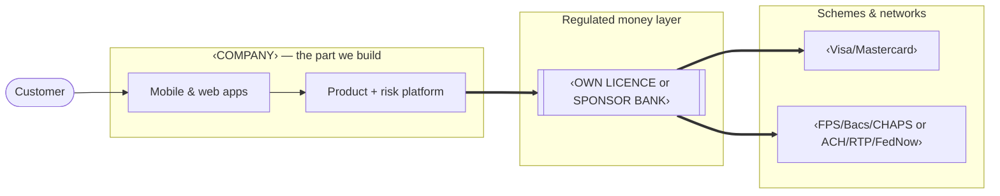
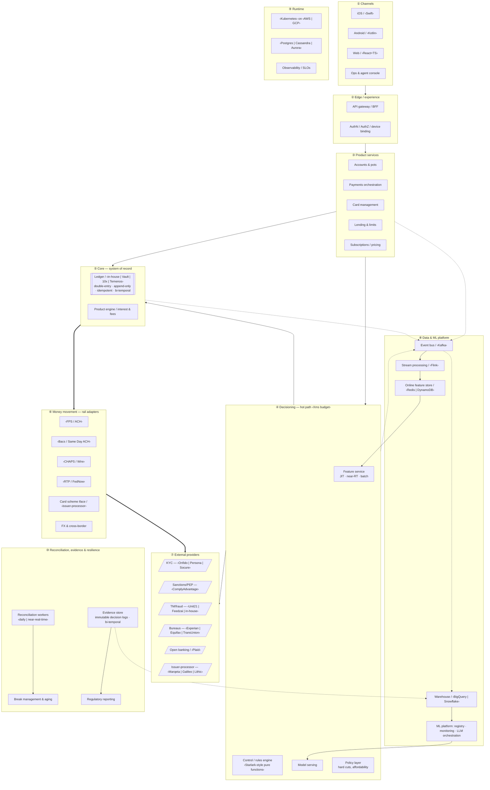
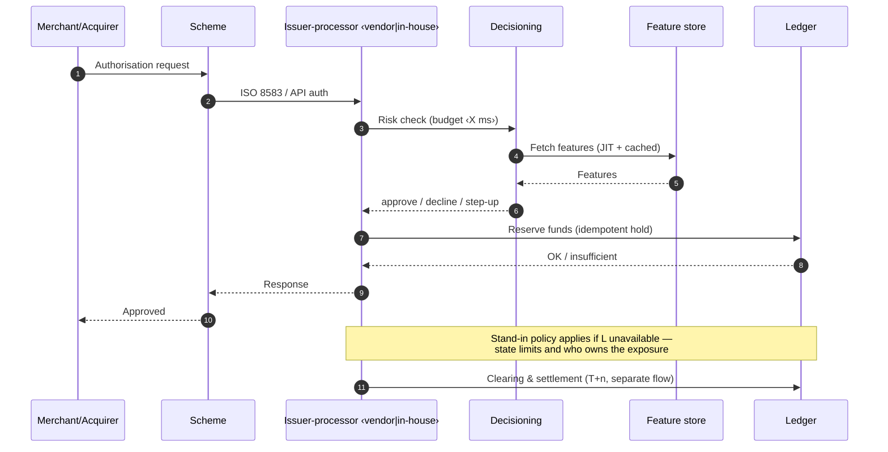
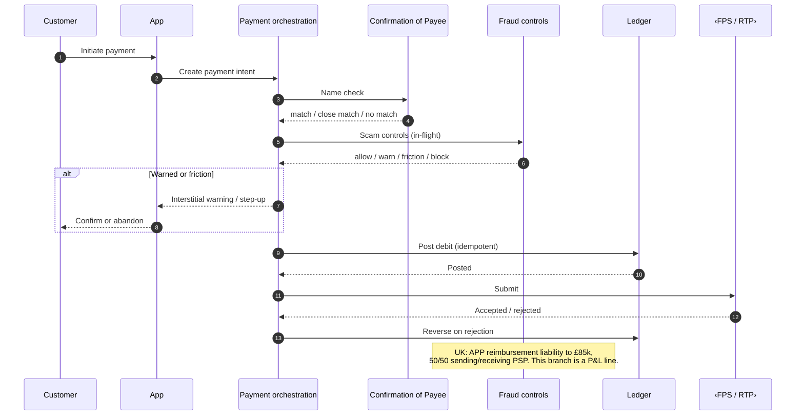
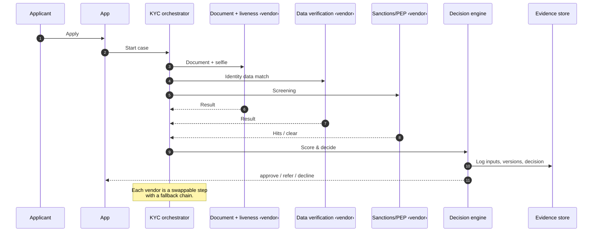
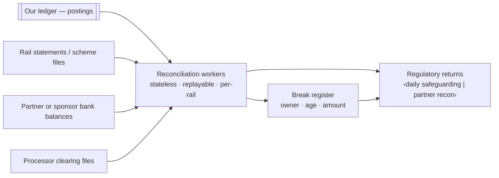

# Neobank architecture diagram template

A fill-in-the-blanks Mermaid skeleton plus the conventions that make these diagrams
comparable across companies. Copy this file, replace every `‹PLACEHOLDER›`, delete what does
not apply, and file the result in `diagrams/`.

## Rules that make a diagram useful

1. **Bands, not clouds.** Lay the diagram out in horizontal bands matching the ten layers in
   `wiki/layers/00-layer-map.md`. Every box belongs to exactly one band. If you cannot place a
   box, you do not understand it yet.
2. **Label every box with `name / vendor-or-inhouse / confidence`.** `Ledger / in-house /
   [confirmed]`. A diagram without provenance is a wish list.
3. **Mark the regulated boundary.** Draw an explicit line showing which side holds the money.
   This is the single most informative element and almost every published diagram omits it.
4. **Show the two planes.** Reconciliation flows and evidence/decision-log flows get their own
   line style. They are usually invisible in architecture diagrams and are where the failures
   are.
5. **Annotate the hot path with its latency budget.** The card authorisation path is the only
   part with a hard deadline. Write the number on it.
6. **One diagram per question.** A single "everything" diagram is a poster, not a tool. Produce:
   a context diagram, a layered component diagram, and one sequence diagram per critical flow.

## Legend (use consistently)

| Element | Meaning |
| --- | --- |
| Solid box | In-house component |
| Dashed box | Third-party vendor |
| Double border | Regulated entity / system of record |
| Solid arrow `-->` | Synchronous request in the critical path |
| Dotted arrow `-.->` | Asynchronous event / stream |
| Thick arrow `==>` | Money movement |
| `~~~` or a distinct colour | Reconciliation or evidence flow |

---

## Diagram 1 — Context (who is who)

Replace `‹OWN LICENCE or SPONSOR BANK›` honestly. If it is a sponsor bank, add a second box
for the **partner ledger** and a reconciliation arrow between it and yours — that relationship
is the thing regulators examine.

---

## Diagram 2 — Layered component view (the main one)

### Fill-in checklist

- [ ] Every `‹…›` replaced or the box deleted
- [ ] Confidence tag on every third-party box
- [ ] Regulated boundary drawn and labelled
- [ ] Latency budget written on the decisioning band
- [ ] Reconciliation frequency stated (daily? near-real-time? what does the regulator require?)
- [ ] Stand-in authorisation path shown (what happens when the ledger is unavailable?)
- [ ] Failure/degraded mode noted for each critical vendor

---

## Diagram 3 — Sequence: card authorisation (the hot path)

## Diagram 4 — Sequence: outbound instant payment with scam controls (UK-shaped)

## Diagram 5 — Sequence: onboarding

## Diagram 6 — Reconciliation (the one everyone omits)

---

## How to use this with the wiki

1. Pick the company or the design you are documenting.
2. Answer `templates/key-questions.md` for it first. The answers *are* the diagram labels.
3. Fill the skeleton, keep the confidence tags.
4. Save to `diagrams/‹name›.mmd` and link it from the relevant wiki page and `index.md`.
5. Anything you could not answer goes into `open-questions.md` — that is the daily scout's
   work queue.
